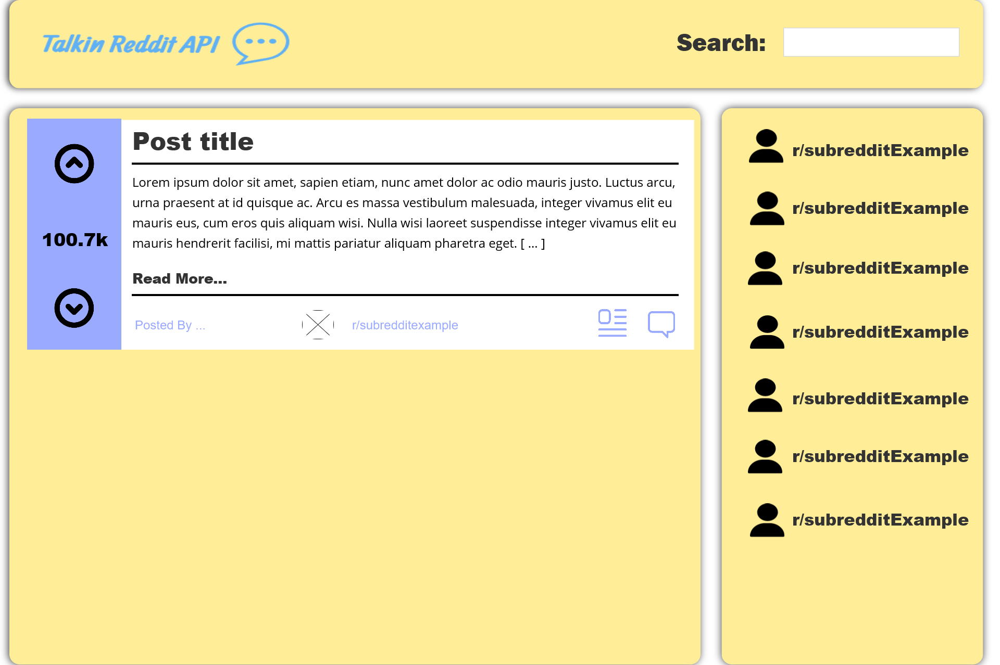
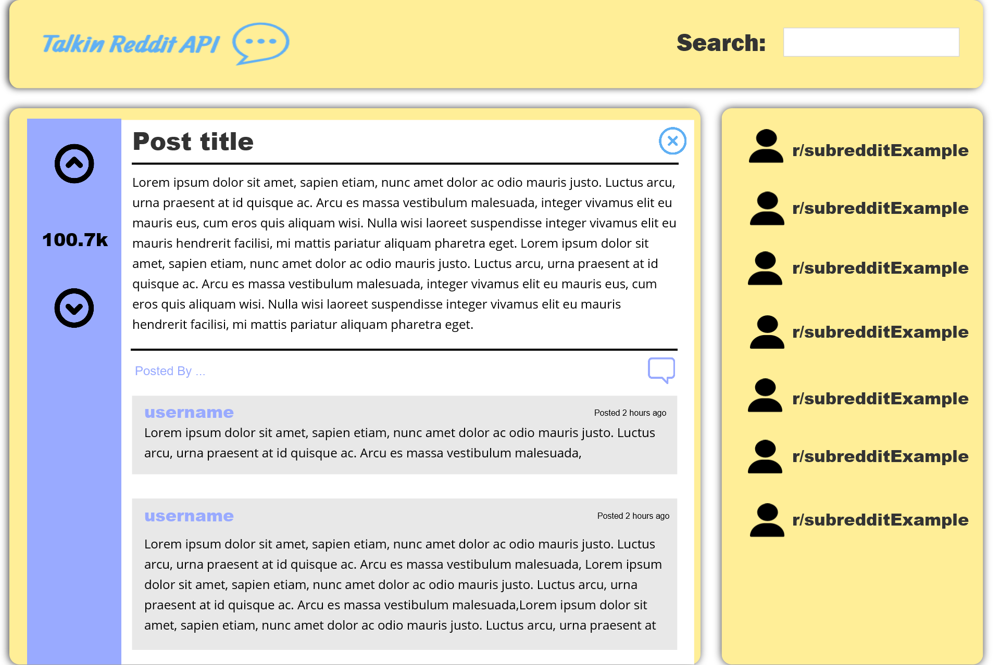
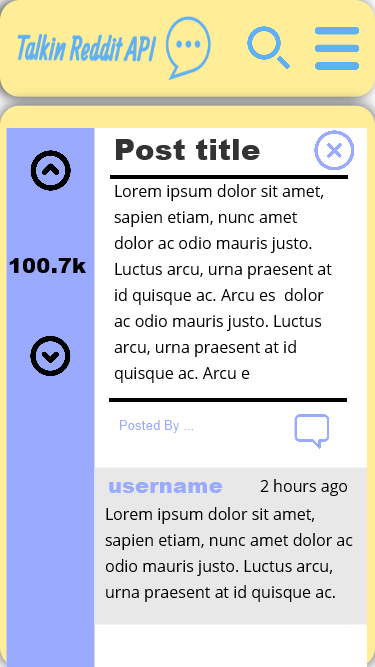

# Talkin Reddit API
This is my React App "Talkin" made for the codecademy Reddit Client project from the PATH.

## Wireframes

- Initail Desktop 1920 view

- Detailed Desktop 1920 view

- Initail Iphone 8 view

- Detailed Iphone 8 view
