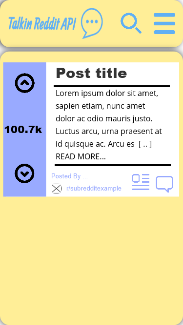

# Talkin Reddit API
This is my React App "Talkin" made for the codecademy Reddit Client project from the PATH.

## Wireframes

| Initial Desktop 1920 view | 
|:--------:| 
|  | 
| centeredcenteredcenteredcenteredcenteredcentered |

| Detailed Desktop 1920 view | 
|:--------:| 
|  | 
| centeredcenteredcenteredcenteredcenteredcentered |

| Initial Iphone 8 view |                                         
|:--------:| 
|  | 
| centeredcenteredcenteredcenteredcenteredcentered |

| Detailed Iphone 8 view | 
|:--------:| 
|  | 
| centeredcenteredcenteredcenteredcenteredcentered |